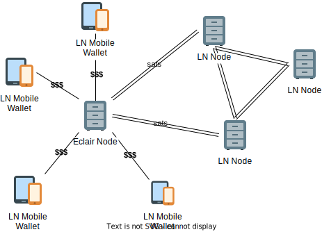

## Volatility Protection

> Hugo Conteras, a shirtless twentysomething, stands on the shore with a long lens, photographing them (surfers). Later, 
he offers to sell them a series of the best shots for about $20. He tells me surfers sometimes ask if he’ll take 
Bitcoin. He’s taken it on a few occasions, but the dips in price burned him. “Now I tell them it’s $25 if they want to 
pay in Bitcoin,” he tells me. “You don’t know when it’s going to go down.” ^1

All economical activities of general public are measured in local currency units, while Lightning Network (LN) is a 
by-design monoasset network based on Bitcoin. Some services like Strike (and Chivo?) bridge this gap by implementing a 
proprietary closed-loop settlement solutions for limited use cases. But the industry of ‘fiat denominated layers’ 
currently lacking:

 - Interoperability across LN network with native properties
 - LN backward compatibility
 - Fiat denominated accounts backed with sats
 - Instant hedge instrument against Bitcoin volatility for fiat-based business and convenience of new bitcoin users

Market Cap of stablecoins has surpassed $300B, making it a proven “glue” / bridge / layer of abstraction between fiat 
and bitcoin markets for centralized institutions. But stablecoin implementation on top of native bitcoin lightning 
“payment rails” still does not exist. Costs incurred for stablecoin settlement on any other network are exceeding 
day-to-day transactions standards, making the Bitcoin-based real-world economy dysfunctional.

## Manage Your Risks Non-Custodially

The proposed *Standard Sats* solution is based on recently announced “hosted channels” standard implementation 
(aka “custodial channels” or “host-channels”). Host-channels could be modified to support constant nominal value in 
fiat currency while being programmatically backed by corresponding amount of sats. The most advantageous part of the 
proposal is that payments from/to such fiat channels will be transferred on top of LN network original nodes w/o any 
limitations.

This way users can finally split the experience between fiat<–>Bitcoin while maintaining 100% compatibility with LN 
specifications. Technically, a client-side app generates standard LN messages / packets and host-side, after settling 
client-host fiat relations, provides routing of payments in the network according to the protocol rules.

The fiat-channel module for lightning node could be used for a trust-based community bank in the remote unbanked village.
This setup would ensure market-neutral position of participants on most effective way, technically and economically.

## References

1 - [Bitcoin Beach: What Happened When an El Salvador Surf Town Went Full Crypto](https://www.bloomberg.com/news/features/2021-06-17/world-s-biggest-bitcoin-experiment-is-a-surf-town-in-el-salvador)

2 - [Liquidity abstraction in Lightning Network](https://notgeld.medium.com/liquidity-abstraction-in-lightning-network-3d7a1d76ac82)