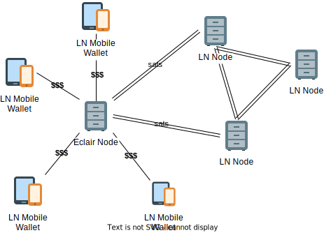

## Защита от волатильности

> Хьюго Контерас, двадцатилетний парень без рубашки, стоит на берегу с длинным объективом и фотографирует их (cёрферов). 
Позже он предлагает продать им серию лучших снимков примерно за 20 долларов. Он говорит мне, что серферы иногда 
спрашивают, будет ли он снимать биткоин. Он несколько раз принимал его, но падение цены обожгло его. "Теперь я говорю 
им, что это 25 долларов, если они хотят заплатить в Биткойн", - говорит он мне. "Вы не знаете, когда он упадет". ^1

Люди обычно измеряют ценность в местных денежных единицах, в то время как Lightning Network (LN) является сетью
одного актива (Биткоина). Некоторые сервисы, такие как Strike и Chivo, преодолевают этот разрыв, внедряя собственные 
решения для платежей в своих замкнутых сетях, для ограниченных случаев использования. Однако все такие решения имеют 
недостатки:

 - Нет полной совместимости с сетью LN
 - Исходный код таких сервисов закрыт
 
Общий объём выпущенных стейблкоинов превысил $300B, что делает их надежным мостом между фиатным и биткоин рынками для 
централизованных учреждений. Однако ещё не существует стейблкоинов, которые работали бы в LN.

## Управляйте рисками сами

*Standard Sats* предлагает программное обеспечение, которое позволяет самостоятельно развернуть узел LN c поддержкой 
особых "хост-каналов". Хост-каналы могут быть модифицированы таким образом, чтобы поддерживать постоянную номинальную 
стоимость в фиатной валюте, будучи программно обеспеченными соответствующим количеством сатов. Наиболее выгодным 
свойством таких каналов является то, что платежи от/к таким фиатным каналам будут передаваться поверх исходных узлов 
сети LN без ограничений и _приватно_.

Программное обеспечение может выступать как сервис для небольших сообществ. Тогда, узел и сервисы берут на себя работу
по автоматическому поддержанию нейтральной рыночной позиции при транзакциях пользователей, сохраняя 100% совместимость 
со спецификациями LN. Технически, приложение на стороне клиента генерирует стандартные сообщения / пакеты LN, а на 
стороне хоста, после урегулирования фиатных отношений между клиентом и хостом, обеспечивает маршрутизацию платежей в 
сети в соответствии с правилами протокола.

## Ссылки

1 - [Bitcoin Beach: What Happened When an El Salvador Surf Town Went Full Crypto](https://www.bloomberg.com/news/features/2021-06-17/world-s-biggest-bitcoin-experiment-is-a-surf-town-in-el-salvador)

2 - [Liquidity abstraction in Lightning Network](https://notgeld.medium.com/liquidity-abstraction-in-lightning-network-3d7a1d76ac82)