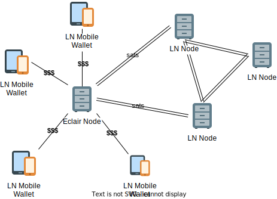

**Standard Sats** — это сервис для решения проблемы высокой волатильности биткойна по отношению к евро с 
помощью хэджирования. Это автономный Биткойн-банк для географически распределенных сообществ или бизнесов.
Продукт состоит из клиента протокола (мобильный биткойн-кошелек; модифицированная версия [Simple Bitcoin Wallet](https://github.com/Tactical-Advantage-Trading/wallet)) и узла, выполненных на основе открытого исходного кода. Узел работает в сети Lightning Network. 
Начните пользоваться — смотрите [инструкцию по подключению кошелька](https://docs.google.com/document/d/1PyTQkZ5kc4KA7_Mt86CkOWm-I4bMd51xt1PsRotYNBU/edit?usp=sharing).

## Механизм работы

Пользователь устанавливает кошелек (на май 2022 была доступна только Android-версия; эта информация может быть устаревшей). Поскольку "фиатный" канал открыватеся
автоматически, его можно пополнить сатошами сразу после установки. Пользователь всегда может 
открыть обычный канал к любому Lightning-узлу, если это требуется и если у него есть биткойны в данном кошельке. При 
пополнении "фиатного" канала сервис фиксирует стоимость биткойн/евро, открывая позицию на бирже [Kollider](https://kollider.xyz/). 
Пользователь видит в кошельке располагаемую сумму в евро, не зависящую от биржевого курса биткойна. 
Таким образом, создается новый производный от биткойна актив, сравнимый с персональным стейбл-койном. 
Посмотрите [видео работы такого кошелька](https://youtu.be/7bvFbpivc0E?t=39) (на англ).

## Сценарии использования

* Частный предприниматель принимает оплату за работу в евробиткойнах, будучи уверенным в возможности 
  оплатить текущие счета за жилье, еду, страховку и т.п.

* Человек без банковского счета из Черногории обращается к коллеге из Германии с просьбой купить некий
  товар за евро и отправить почтой. Предоплату за товар переводит с помощью Standard Sats. Покупатель товара 
  застрахован от падения стоимости биткойна. 

## Ответы на типичные вопросы

### Предоставляет ли сервис доступ к своему узлу? Если да, то может ли админ сервера теоретически украсть мои биткойны?

Да, "фиатные" каналы по умолчанию управляются проектом Standard Sats и администратор сервиса может украсть ваши 
Биткойны. Вы можете установить программное обеспечение на свой сервер, чтобы самостоятельно администрировать его. 

### В чем отличие от стейблкойнов? 

Стейблкойны обычно выпускаются централизованным эмитентом. Например, для Tether — это панамский банк. Они 
являются гарантиями на фиатные деньги, требующими доверия к выпускающему их банку. А у синтетического актива — 
нет централизованного эмитента.

### Какова вероятность кражи моих активов в случае взлома биржи? Какие гарантии? Есть ли прецеденты?

Любые токены, хранящиеся на бирже, подвержены рискам взлома или банкротства биржи. В общем случае это 
называется риск неплатёжеспособности. Увы без этого риска нельзя пользоваться и рынком капитала, который 
биржи предоставляют. Оценивайте свои риски сами, перед тем как решиться на установку программного 
обеспечения и открывать персональный аккаунт на бирже для его работы. Увы, за более чем 10-летнюю историю
существования Биткойна мы можем насчитать много прецедентов взлома и банкротства бирж.

### Кто стоит за проектом? 

Создатели проекта — разработчики Илья Евдокимов и Антон Гуща, создавшие прототип продукта в Ноябре 2021 
года в рамках банковского хакатона. Финансируется разработка проекта за счет собственных средств 
основателей. Вы можете отправлять пожертвования через Lightning Network на 
[standardsats@lntxbot.com](https://lntxbot.com/@standardsats). Перейдите по ссылке, если ваш кошелёк не 
поддерживает Lightning Address.

### На чем зарабатываeт администратор узла?

Установив программное обеспечение Standard Sats, пользователь становится администратором своего сервера и может 
зарабатывать на комиссиях от маршрутизации платежей в сети Lightning. Однако Standard Sats не несёт 
ответственности за действия пользователя или биржи, на которой будет происходить хэджирование. Также доход от 
маршрутизации платежей не является гарантированным.

### Существуют ли примеры использования? 

Да. На Май 2022 проект развернут в сообществе [MonteLibero](https://montelibero.org)

## Важные Оговорки и Дисклеймеры

### Дисклеймер об ответственности за программное обеспечение

Всё программное обеспечение в репозитории Standard Sats поставляется по принципу "as is" ("как есть"). 
Никакие гарантии не прилагаются и не предусматриваются. Разработчики и мейнтейнеры не несут никакой 
ответственности за ущерб, вызванный запуском, распространением или использованием этого открытого 
программного обеспечения, включая, но не ограничиваясь:

- Потерей или искажением данных
- Нарушением работоспособности других программ и систем
- Потерей средств или криптовалюты
- Любой упущенной выгодой или финансовым ущербом в процессе использования данного программного продукта
- Сбоями в работе или уязвимостями безопасности

Вы используете данное программное обеспечение полностью на свой страх и риск. Авторы и разработчики не 
несут ответственности за любые последствия вашего использования или неправильного использования этого ПО.

### Финансовый риск и нормативный дисклеймер

Standard Sats предоставляет инструменты для хеджирования криптовалюты и финансовых транзакций. 
**Разработчики не предоставляют финансовый совет, юридический совет или нормативное руководство.**

- Сервис включает операции на бирже и риск контрагента с третьими сторонами
- Рынки биткойна и криптовалют крайне волатильны и рискованны
- Вы можете потерять всю сумму инвестиций
- Администратор сервиса может теоретически иметь доступ к вашим средствам
- Не применяются страхование, гарантии или нормативная защита

**Нормативное соответствие:** Физические лица или организации, предоставляющие услуги криптовалюты с использованием 
этого программного обеспечения, могут быть обязаны получить лицензии или нормативные одобрения в зависимости от 
своей юрисдикции. Разработчики не дают гарантии относительно требований нормативного соответствия и не предоставляют 
юридический или нормативный совет. Вы несете полную ответственность за определение и соблюдение всех применимых 
законов и норм в вашей юрисдикции.

Используйте это программное обеспечение только если вы полностью понимаете риски и можете позволить себе потерять 
ваши средства. Проконсультируйтесь с финансовым советником и юристом перед принятием инвестиционных решений или 
предоставлением услуг на основе этого программного обеспечения.

### Пожертвования

Пожертвования, упоминаемые на этом сайте, **полностью добровольны** и **не связаны с использованием программного обеспечения**. 
Вы можете использовать, модифицировать и распространять это программное обеспечение свободно без каких-либо пожертвований. 
Пожертвования не предоставляют никакую специальную поддержку, гарантии или привилегии.

### Атрибуция открытого исходного кода

Этот проект использует код из [Simple Bitcoin Wallet](https://github.com/Tactical-Advantage-Trading/wallet) 
и кошелька [Valet](https://github.com/standardsats/valet).
Подробности см. в файле LICENSE.

## Ссылки

1 - [Bitcoin Beach: What Happened When an El Salvador Surf Town Went Full Crypto](https://www.bloomberg.com/news/features/2021-06-17/world-s-biggest-bitcoin-experiment-is-a-surf-town-in-el-salvador)

2 - [Liquidity abstraction in Lightning Network](https://notgeld.medium.com/liquidity-abstraction-in-lightning-network-3d7a1d76ac82)